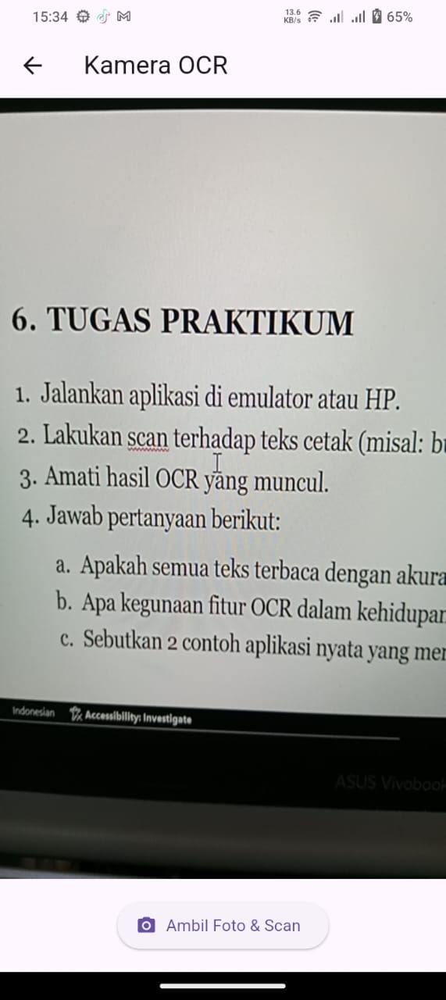
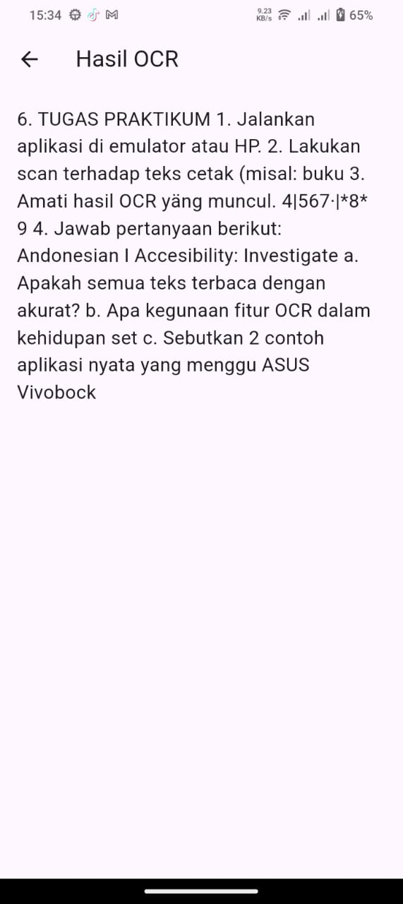
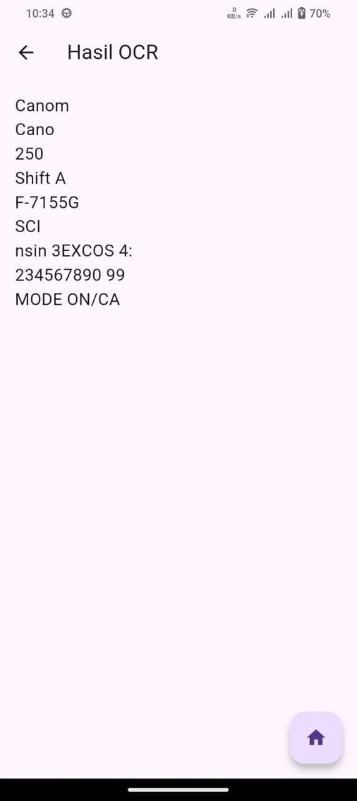
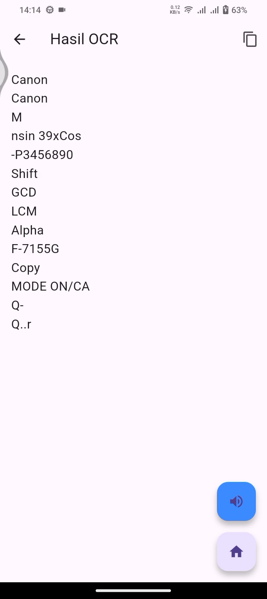

# JOBSHEET 7 & UTS – APLIKASI OCR  DENGAN FLUTTER 
## Hasil Praktikum

### Home Screen

### Scanning

### Hasil Scanning

## Hasil UTS
### Soal 1 Modifikasi Struktur Navigasi dan Aliran 
### Home Screen

### Result

### Soal 2 Penyesuaian Tampilan dan Penanganan State/Error
### Loading Screen

### Error Message

### Soal 3 Implementasi Plugin Text-to-Speech (TTS)
### Result
### [Lihat Video Demonstrasi TTS di Google Drive](https://drive.google.com/file/d/1vWb6d3STC0L_wbccPfqFjlLJHQUeYcPY/view?usp=sharing)

